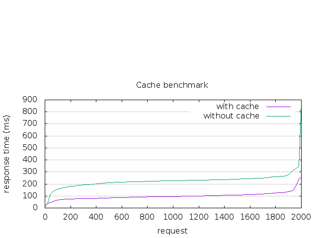

## Forum-API
> This is a forum API built with Golang

### Get Start

### Technologies Used

- [Golang](https://golang.org).
- [Gin Framework](https://github.com/gin-gonic/gin).
- [GORM](http://gorm.io).
- [Swag](https://github.com/swaggo/swag)
- [Redis](https://redis.io)

Database


### Install
#### Clone
```
git clone git@github.com:LixvYang/Forum-API.git
```
#### Set up
> **Ensure that you check Db floder set up and Create your database.**
> 
> _**db/db.sql must be used.**_

- For local, set the _DbHost_ in the `config/config.ini`
- And config your DB password
  ```
  DbHost = 127.0.0.1
  ```
- Init redis with docker:
  ```go
  docker run -d --name redis -p 6379:6379 redis:6.0
  ```
> In the root directory, run the command.
```
swag init --parseDependency --parseInternal
```
Wait patiently for the end.

Open browser with http://localhost:3000/swagger/index.html#/ to check document.


### Start service
```
go run main.go
```
OR run in release mode.
```
./start.sh
```

### Benchmark
```
ab -n 2000 -c 100 -g without-cache.data http://localhost:3000/api/v1/users
```

```
ab -n 2000 -c 100 -g with-cache.data http://localhost:3000/api/v1/users
```

```
gnuplot apache-benchmark.p
```

After bennchmark  with redis show

  
## Author
[Lixv](https://github.com/lixvyang)

## LICENSE
[MIT](LICENSE)


