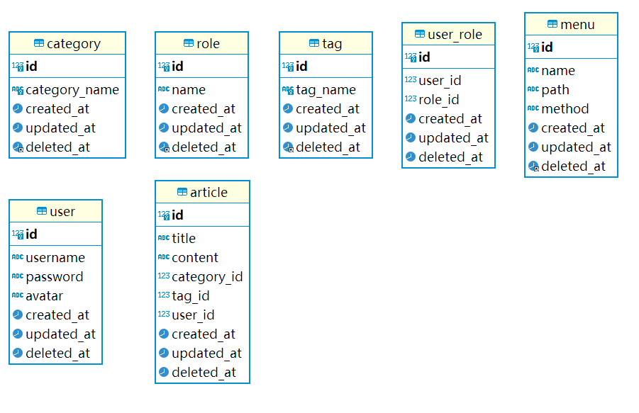

## Forum-API
> This is a forum API built with Golang

### Get Start


### Technologies Used

- [Golang](https://golang.org).
- [Gin Framework](https://github.com/gin-gonic/gin).
- [GORM](http://gorm.io).
- [Swag](https://github.com/swaggo/swag)
- [Redis](https://redis.io)

Db 


### Install
#### Clone
```
git clone git@github.com:LixvYang/Forum-API.git
```
#### Set up
> **Ensure that you check Db floder set up and Create your database.**
> 
> _**db/db.sql must be used.**_

- For local, set the _DbHost_ in the `config/config.ini`
- And config your DB password
  ```
  DbHost = 127.0.0.1
  ```

> In the root directory, run the command.
```
swag init --parseDependency --parseInternal
```
Wait patiently for the end.

### Start service
```
go run main.go
```

Open browser with http://localhost:3000/swagger/index.html#/

## Author
Lixv

## LICENSE
MIT


